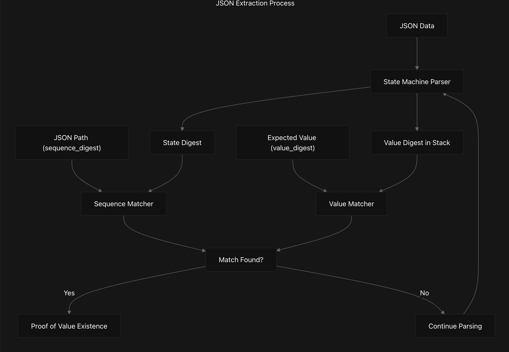

# JSON Parser and Extractor for Zero-Knowledge Circuits 
## Overview 
This library implements a JSON parser and extractor for zero-knowledge circuits, ported from the original Circom implementation in the [pluto/web-prover-circuits](https://github.com/pluto/web-prover-circuits) repository to Noir. It enables selective disclosure of JSON values from encrypted data, allowing applications to prove the existence of specific values within JSON structures without revealing the entire content.

The implementation consists of a stack-based state machine that processes JSON data byte-by-byte, tracking the structure of objects and arrays while computing cryptographic hashes for verification.

## Key Components
### 1. Json Extractor(extractor.nr)

The main component that processes JSON data to find and extract specific values based on a provided path (sequence digest) and expected value (value digest). It verifies that a specific path within the JSON leads to an expected value, producing a zero-knowledge proof of this relationship.

<div align="center">  
    
</div>

### 2. State Machine Parser (machine.nr) 
The core parser that implements a state machine to process JSON data byte-by-byte. It maintains a stack to track the current position in the JSON structure and computes hashes of keys and values.

Key functions: 
- state_update_hasher: Updates the parser state based on the current byte
- rewrite_stack: Modifies the stack and tree hash based on the current byte and parsing state
- state_to_mask: Generates masks to control state transitions based on the current parsing context

### 3.Utility Functions(utils.nr) 
Helper functions for hash computation, data conversion, and JSON path handling:

- polynomial_digest: Computes a polynomial hash of an array
- compress_tree_hash: Compresses the stack and tree hash into a single digest
- json_tree_hasher: Generates stack and tree hash structures for a given JSON path

### 4.Language Contants(language.nr) 
Defines constants for JSON syntax elements and test parameters:

- ASCII character codes for JSON delimiters, numbers, and keywords
- Test parameters for stack height, data bytes, and public I/O length

## Usage 
#### Basic Example 
```noir  
// Create an extractor for a JSON payload  
let extractor = ExtractorState {  
    data: json_bytes,  
    ciphertext_digest: ct_digest,  
    sequence_digest: seq_digest,  
    value_digest: val_digest,  
    state: initial_state,  
};  
  
// Process the JSON data and extract the value  
let step_out = extractor.extract(step_in);  
  
// The first element of step_out will contain the value_digest if the value was found  
assert(step_out[0] == value_digest);
```

#### Create a JSON Path 
To create a sequence digest for a JSON path: 

```noir  
// Define the key sequence (e.g., data.items[0].profile.name)  
let key_sequence = [  
    JsonMaskType { is_array_index: false, value: convert_to_field_array("data"), array_index: 0 },  
    JsonMaskType { is_array_index: false, value: convert_to_field_array("items"), array_index: 0 },  
    JsonMaskType { is_array_index: true, value: [0; DATA_BYTES], array_index: 0 },  
    JsonMaskType { is_array_index: false, value: convert_to_field_array("profile"), array_index: 0 },  
    JsonMaskType { is_array_index: false, value: convert_to_field_array("name"), array_index: 0 },  
];  
  
// Generate stack and tree hashes for the key sequence  
let (stack, tree_hashes) = json_tree_hasher(ciphertext_digest, key_sequence);  
  
// Compute the sequence digest  
let sequence_digest = compress_tree_hash(stack, tree_hashes, monomials);
```
#### Runnning test 
Assume you are already under json folder , run the following :
```
# Run all tests  
nargo test  
# Run specific tests  
nargo test <specific file you want to run test>  
...
```

### Technical Details 
#### State Representation

The JSON parser maintains several key state components: 
1. Stack: A 2D array where each entry contains: 
- First element: Type indicator (1 for object, 2 for array)
- Second element: Position indicator (0/1 for object key/value, index for array)

2. Tree Hash: A 2D array accumulating hash values: 
- First element: Hash of object keys 
- Second element: Hash of values

3. Parsing Flags: 
- `parsing_string`: Whether currently parsing a string 
- `parsing_primitive`: Whether currently parsing a primitive value
- `escaped`: Whether the previous character was an escape character

### Polynomial Digests
The library uses polynomial digests to efficiently represent and compare JSON structures:

- `Sequence Digest`: Represents the path to a value in the JSON
- `Value Digest`: Represents the expected value at that path
- `State Digest`: Represents the current parser state

Polynomial digests are calculated as: 
```
digest = bytes[0] + bytes[1]*base + bytes[2]*base^2 + ...  
```
where `base` is the `ciphertext_digest`.

### License
This project is licensed under the Apache License, Version 2.0.

